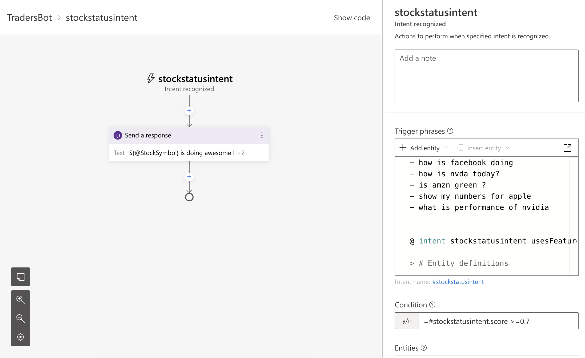
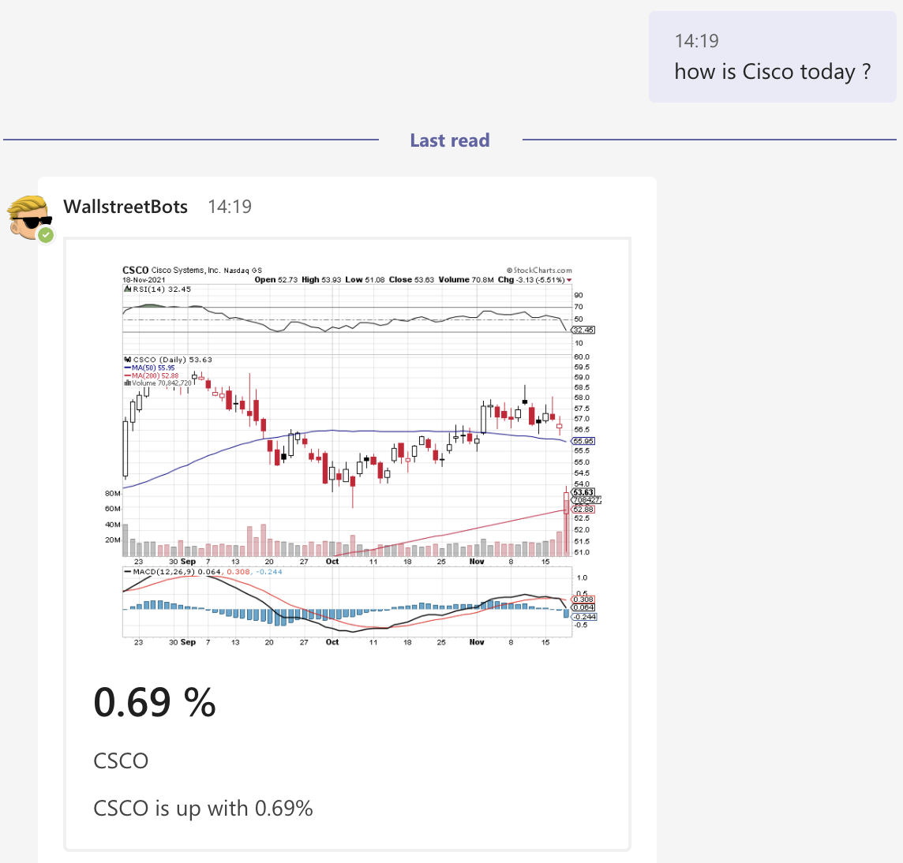
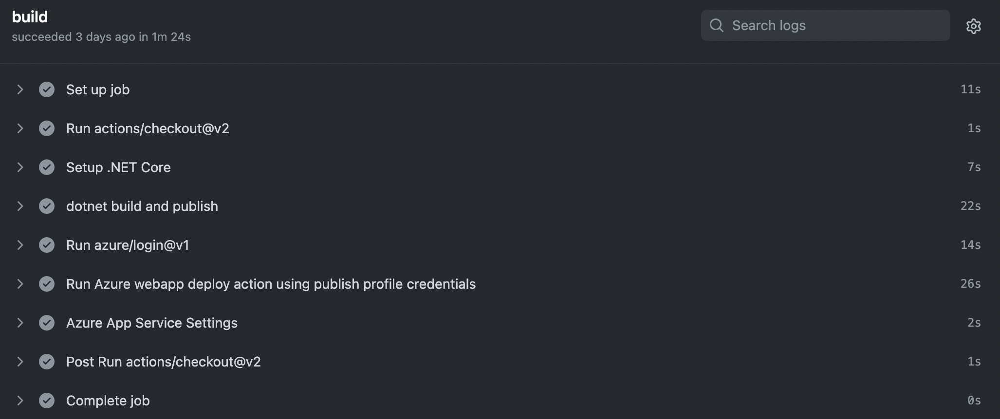

# Are you talking to me?  
# A session on conversational A.I.

## Introduction

This repo contains the presentation, the code and documentation on everything that is used in my presentation on Azure Language Understanding and the Bot Framework.

Free to use and get inspired by.

## NLTK & NLP Pyramid

This demo briefly demonstrates how you can breakdown texts and sentences by the different part of the NLP pyramid.  For this, the python scripts are provided and leverage the `nltk`package.  (Natural Language ToolKit) that you can easily install by executing the following command.

```bash
pip install nltk
```

In order to run the samples, it is needed to download some dictionaries and vocabularies through NTLK.  This is needed as a pre requisite for some of the tokenization & stemming.

For that, you can comment out the lines that start with `nltk.download`, such as below:

```python
#nltk.download('averaged_perceptron_tagger')
#nltk.download('punkt')
```

### Stemming / tokenization

The first script [01-nltk-demo.py](src/01-nltk/01-nltk-demo.py) runs a sentence through the tokenizer and prints the stem/base of every word

### NLP Pyramid script

The second script [02-nlp-pyramid.py](src/01-nltk/02-nlp-pyramid.py) shows more possibilities of the NLTK toolkit.

The following topics get demonstrated:
- Stemming: the base of the words & verbs
- POS Tagging: part of speech tagging.  The grammar in your sentence.
- IOB Tagging: detecting chuncks that belong together (such as New York)

## Luis: Language Understanding Intelligence Service

### The LUIS application for the WallstreetBot

The LUIS application is built in the [LUIS portal](https://luis.ai) online.  But you can easily import the version of the LUIS application by creating a new LUIS Application that you import from .LU file.  The file is called [WallstreetBot.lu](src/02-luis/WallstreetBot.lu) and it contains all the intents, utterances and entities that are defined. 

To import it: 
1. Go to the [LUIS portal](https://luis.ai)
1. Login with your credentials
1. Click the arrow for the sub menu on 'New App' and select 'Import as LU'.
   
    
1. Your application is now ready to be tested, deployed and consumed.

### The LuisListEntityGenerator application

This dotnet core console Application can be used to convert a CSV file into a JSON file that can be imported as a List Entity in LUIS.

To run it:

Run the application with the following arguments:

- --input (Required): The name of the CSV file
- --output (Required): The name of the JSON file to be created
- --canonicalfield (Required): The name of the column in the CSV file (header line is required) that will be the key for your entity
- --columnlist (Required): The columns (comma seperated) that will be added as list to the entity.
- --delimiter (default: ,): CSV delimiter

An example could be:

```bash
dotnet LuisListEntityGenerator -i nasdaq-entitylist.json -o nasdaq-symbols.csv -c Symbol -l FriendlyName -d ;
```

### Import the list entity in the LUIS portal

To import it: 
1. Go to the [LUIS portal](https://luis.ai)
1. Login with your credentials
1. Go to your application
1. Create a new entity of type List with name StockItem
1. Click Import values and select the [JSON file](src/02-luis/data/nasdaq-symbols.json)
   
    

## Bot Framework Composer 

The Bot Framework composer is a tool that allows users to visually design (drag/drop) Bots and dialogs.  It integrates with LUIS and allows users to write part of the LU files, in the UI.

In the samples, there is a very straight forward bot that links with the LUIS application and leverages the List Entity for StockSymbol.  And leverages the intents that get defined in the application.

To open the bot, you have to download the [Bot Framework Composer](https://docs.microsoft.com/en-us/composer/install-composer) first
And then the bot can easily be opened by browsing to the [right directory](src/03-bot/TradersBot), when opening the bot in the composer.



The most relevant part is in the StockStatusIntent dialog.  In the screenshot, you see the following relevant concepts:

- Trigger phrases: these are the utterances that get used to build the model and detect the intent of the user.
- Condition `#stockstatusintent.score >= 0.7` indicates that this dialog will only be initiated, in case the LUIS prediction is more than 70% sure of the intent of the user.
- We are sending back a response, indicating that we detected the StockSymbol entity from the users intent.  For that, we use the following syntax: `${@StockSymbol} is doing awesome !`

## Bot Framework SDK

The most logic and worked out sample can be found in the project [NasdaqBot](src/03-bots/NasdaqBot/../../03-bot/NasdaqBot/NasdaqBot.csproj)

### Dialogs

The main concept of the bots , is the concept of Dialogs.  Things that definately deserve a look in case you want to learn more are the [MainDialog](src/03-bot/NasdaqBot/Dialogs/MainDialog.cs) and the [BuyStockDialog](src/03-bot/NasdaqBot/Dialogs/BuyStockDialog.cs)

The `MainDialog` leverages the three steps in a `WaterFallDialog`:

1. **WelcomeStepAsync**: Welcoming the user
2. **SpecifyRequestStepAsync**: This is the most relevent step, as we are detecting the intent by LUIS and kick off the right sub dialog based on this.
3. **FinalStepAsync**: This is to execut the actual logic and restart the dialog.

When diving a little deeper in the `SpecifyRequestStepAsync` method, you can see how the actual LUIS call happens:

```csharp
var luisResult = await _luisRecognizer.RecognizeAsync(stepContext.Context, cancellationToken);
var topIntent = luisResult.Intents
    .Where(i => i.Value.Score > 0.05)
    .OrderByDescending(i => i.Value.Score).FirstOrDefault().Key;
```

We perform the API call and then take the "top intent" from the response, based on the score it gets.

Based on that intent, the right logic/dialog is triggered.

The `BuyStockDialog` is started by the MainDialog , in building a `BuyStockRequest` object that contains all the detected entities from the LUIS recognizer.

```csharp
var buyStockRequest = new BuyStockRequest();
buyStockRequest.StockSymbol = luisResult.ReadEntity<string>("StockSymbol", true);
buyStockRequest.Amount = luisResult.ReadEntity<int>("Amount");
buyStockRequest.OrderLimit = luisResult.ReadEntity<decimal>("Limit");
// Run the BuyStockDialog giving it whatever details we have from the LUIS call, it will fill out the remainder.
return await stepContext.BeginDialogAsync(nameof(BuyStockDialog), buyStockRequest, cancellationToken);
```

In the actual waterfalldialog, we check at every step of the Dialog if the specific entity was already detected and ask for the information in case it isn't.  If we have the information, we move to the next step. 
An example below shows how are are retrieving the Amount, after the StockSymbol was detected in the first step:

```csharp
var stockRequest = (BuyStockRequest)stepContext.Options;

stockRequest.StockSymbol = (string)stepContext.Result;
string StockAmountMsgText = $"How much of {stockRequest.StockSymbol} should I buy?";

if (stockRequest.Amount == 0)
{
    var promptMessage =
        MessageFactory.Text(StockAmountMsgText, StockAmountMsgText, InputHints.ExpectingInput);
    return await stepContext.PromptAsync(nameof(NumberPrompt<int>),
        new PromptOptions { Prompt = promptMessage }, cancellationToken);
}

return await stepContext.NextAsync(stockRequest.Amount, cancellationToken);
```

### Adaptive cards

When querying for a specific Stock, an adaptive card will be returned with the results of that Stock for the last day, and a chart of the stock price. 

For that, the concept of Adaptive cards is being used.  There are two adaptive cards created in the sample.  One for the Stock.Query and one for the confirmation of the Stock.Buy intent.

Diving a bit deeper in the Stock.Query card.
The card is based on a [json file](src/03-bot/NasdaqBot/Cards/stockresult.json).  This file is being used and some placeholder text is being replaced in the following code, to return the Adaptive card to the user.

```csharp
// combine path for cross platform support
var paths = new[] { ".", "Cards", "stockresult.json" };
var adaptiveCardJson = File.ReadAllText(Path.Combine(paths));
adaptiveCardJson = adaptiveCardJson.Replace("#StockSymbol", result.StockSymbol);
adaptiveCardJson = adaptiveCardJson.Replace("#Result", result.Result.ToString("0.00") + " %");
adaptiveCardJson = adaptiveCardJson.Replace("#Message",
    $"{result.StockSymbol} is {(result.Result > 0 ? "up" : "down")} with {Math.Abs(result.Result):0.00}%");
var adaptiveCardAttachment = new Attachment()
{
    ContentType = "application/vnd.microsoft.card.adaptive",
    Content = JsonConvert.DeserializeObject(adaptiveCardJson),
};

return adaptiveCardAttachment;
```

The card looks like this in the Teams Channel:



### Multiple languages

The sample shows how to support multiple languages in the bot.

For that, there is a custom `IMiddleware` that gets injected and that translates all incoming and outgoing messages from the base language (**en**) to the user's language.  And for that, even the language detection service can be used.

The relevant files:

- [MultiLingualMiddleware.cs](src/03-bot/NasdaqBot/Middleware/MultiLingualMiddleware.cs): this file contains the actual logic/methods that are calling the translations
- [CognitiveTranslater.cs](src/03-bot/NasdaqBot/Languages/CognitiveTranslater.cs): this file is used to translate the text, by using the Azure Cognitive Translator service
- [CognitiveLanguageDetector.cs](src/03-bot/NasdaqBot/Languages/CognitiveLanguageDetector.cs): this service can detect the language of the user, based on the incoming text.

## Deployment

Everything can be automatically deployed through CI/CD with Github actions.  

The build file is in [.github/workflows/main.yml](.github/workflows/main.yml) and performs the following steps:
- Setup .net core
- Build and publish the bot package
- Log in to Azure
- Deploy to Web application
- Set settings & secrets on the Web application

